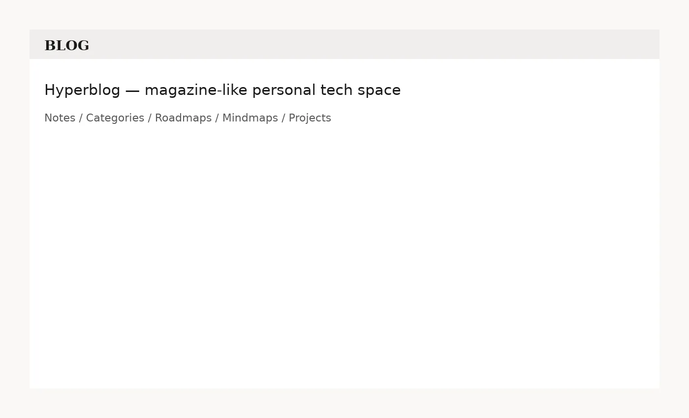
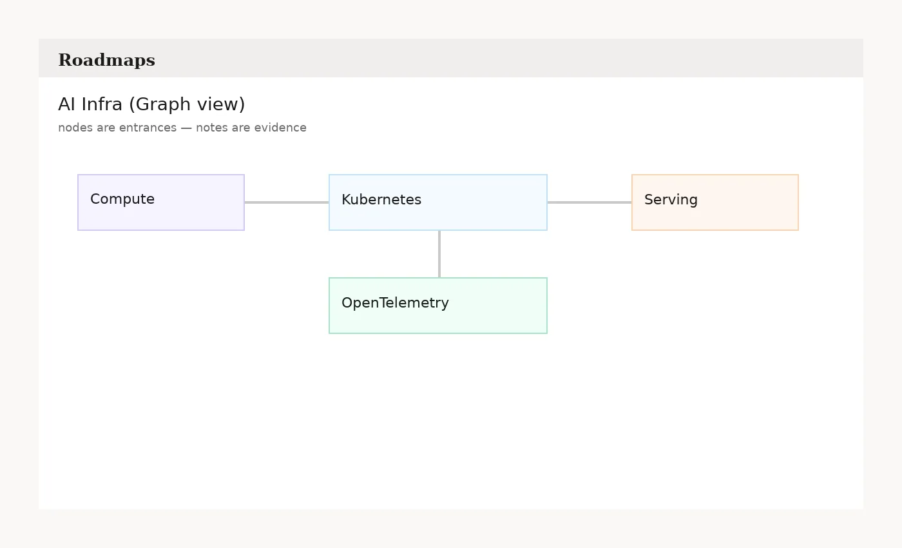

# Hyperblog

一个“可探索的个人技术空间”，更像一本可逛的技术杂志：目录清晰，也能把你的技术栈结构展示出来。

- **Notes** — 文章（不分长短）
- **Categories** — 传统目录（叙事/专题）
- **Roadmaps** — Roadmap-as-File（路线图目录；节点聚合 Notes）
- **Mindmaps** — 思维导图（独立页；可在 Note 中引用）
- **Projects** — 作品集（代码仓库/产品页风格）
- **Studio** — 写作台（本地草稿；统一 Publish → 一次 GitHub commit）
- **Publisher API（可选）** — Cloudflare Workers 写入后端（GitHub OAuth + Bearer Token；原子写 `main`）

<p align="center">
  
</p>

<p align="center">
  
</p>

---

## 核心理念

- **Content as Files**：`content/*` + `public/uploads/*` 是唯一真相；没有数据库，Git 就是历史、diff 与回滚。
- **两套目录并存**：同一批 Notes 同时被 `Categories`（叙事）与 `Roadmaps`（体系）索引。
- **Public is static**：公开站点构建为静态 JSON API（`dist/api/*.json`），任何静态托管都能跑（本仓库默认 GitHub Pages）。
- **Drafts are local**：Studio 的频繁保存只落在浏览器草稿；点 Publish 才写 GitHub，且会把所有改动合并成一次 commit。

---

## 读 / 写链路（极简心智）

```text
读（dev）   content/* ──> Vite 内置 mock (/api/*.json) ──> Public Site
读（build） content/* ──> dist/api/*.json ──────────────> Static hosting (GitHub Pages)

写（publish）Studio ──> Publisher API ──> GitHub commit(main) ──> GitHub Actions build ──> GitHub Pages
```

---

## 快速开始（只看公开站）

> 不需要 Cloudflare / OAuth。只要写 `content/*` 就能预览。

```bash
pnpm install
pnpm dev
```

打开：`http://localhost:5173`

生产预览（最像线上 Pages 的产物）：

```bash
pnpm preview
```

---

## 写内容（文件驱动）

```text
content/
  notes/*.md          # Notes（Markdown + frontmatter）
  categories.yml      # Categories（目录）
  roadmaps/*.yml      # Roadmaps（路线图）
  mindmaps/*.json     # Mindmaps（ReactFlow JSON）
  projects.json       # Projects（作品集）
  profile.json        # 站点配置（含 Hero / Publisher URL）

public/uploads/*      # 资产（图片/附件），前台统一用 /uploads/... 引用
```

格式规范：[`docs/content-formats.md`](docs/content-formats.md)  
站点配置：[`docs/configuration.md`](docs/configuration.md)

---

## 初始化与自检（推荐）

首次部署/换仓库时（少踩坑）：

```bash
pnpm run init
pnpm run doctor
```

---

## 上线（两步走）

1) **公开站点（纯静态）**：GitHub Pages  
2) **线上发布（可选）**：部署 Publisher API 到 Cloudflare Workers → 用 Studio Publish 到 GitHub

完整步骤：[`docs/deploy-guide.md`](docs/deploy-guide.md)

---

## 文档

- 文档目录：[`docs/README.md`](docs/README.md)
- Studio 使用：[`docs/studio-guide.md`](docs/studio-guide.md)
- 内容格式：[`docs/content-formats.md`](docs/content-formats.md)
- 配置说明：[`docs/configuration.md`](docs/configuration.md)
- 部署指南：[`docs/deploy-guide.md`](docs/deploy-guide.md)
- Publisher API 契约：[`docs/backend-contract-v0.md`](docs/backend-contract-v0.md)

---

## FAQ

### 为什么 `dev` / `preview` / Pages 看起来可能不一样？

- 浏览器的主题/强调色/缩放等状态是按「域名 + 端口」隔离存的：`localhost:5173`、`localhost:4173`、`<user>.github.io` 各存一份。
- `pnpm dev` 直接读 `content/*`；`pnpm preview` 跑的是 build 产物（更接近 Pages）。

### 我在 Studio Publish 了，但本地仓库内容没变？

Studio 写入的是 **GitHub main**，不会自动同步到你的本机目录。

- 本地想看到最新内容：在仓库里 `git pull`
