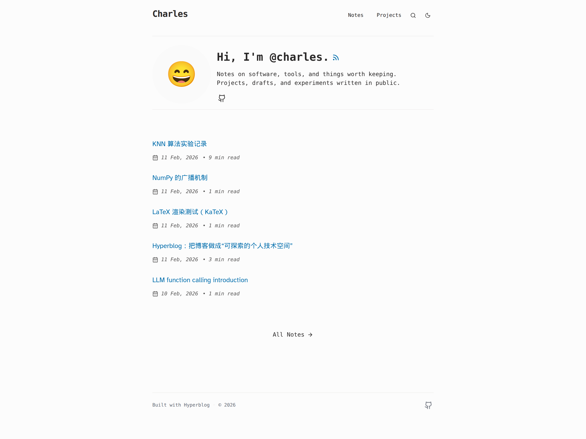
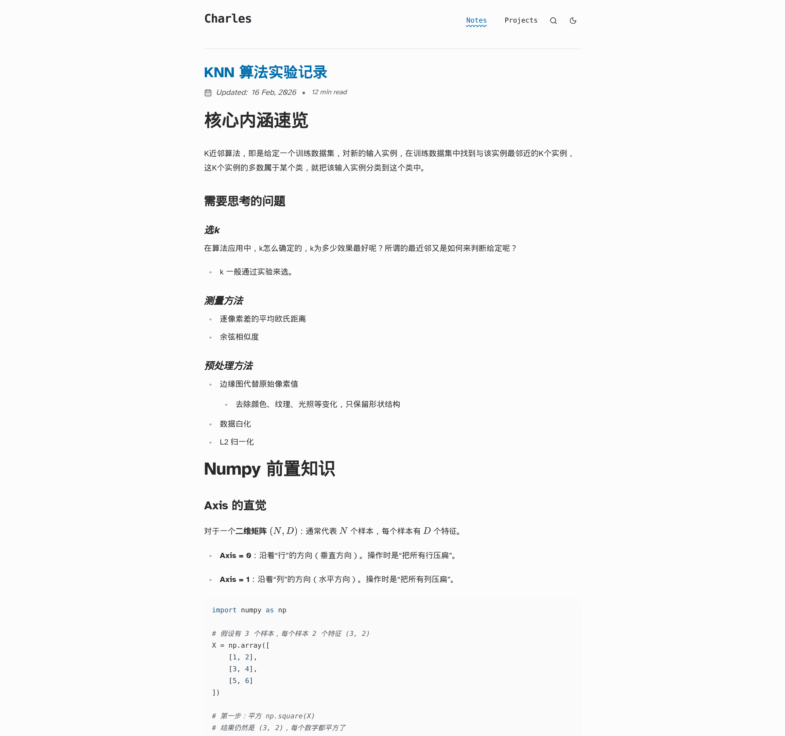
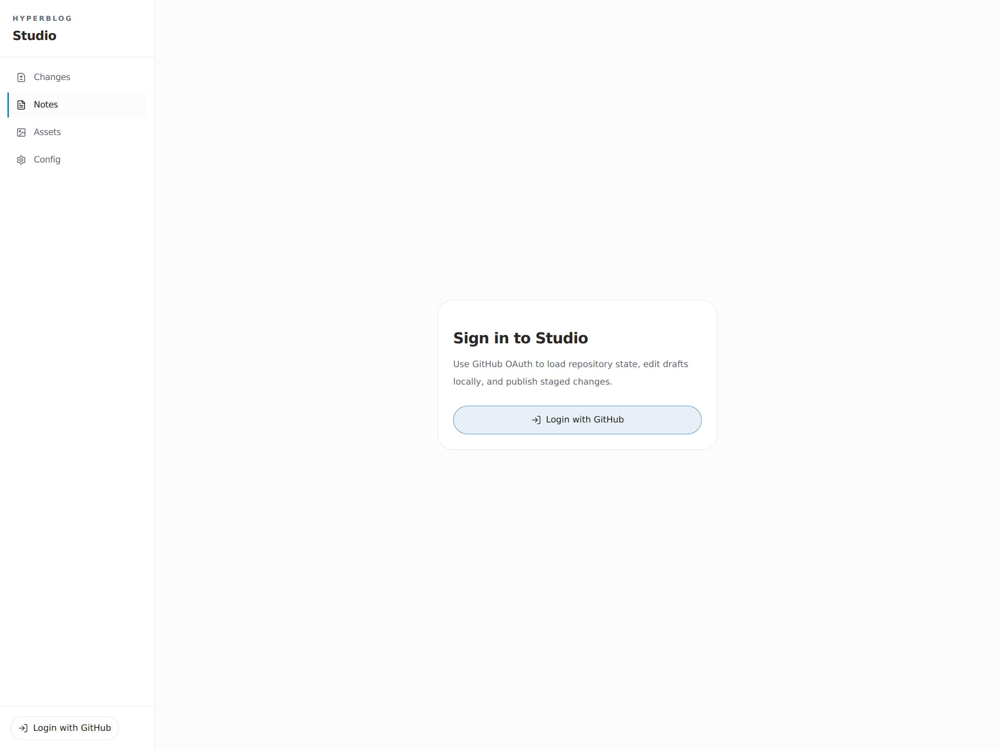

# Hyperblog

Hyperblog 是一套文件驱动的个人站点。

内容直接放在仓库里。公开站点负责读这些文件，Studio 负责网页编辑，Publisher 负责可选的远程写回。你可以只把它当静态博客用，也可以把整套发布链路一起开起来。

如果你只想做这几件事：

- 用 Markdown 写文章
- 用 Git 管内容
- build 成静态站点部署到 GitHub Pages

那只用 `content/`、`public/` 和 `pnpm build` 就够了。

如果你还想：

- 在网页里写 note
- 上传图片和附件
- 登录 GitHub 后直接发布

再把 `Studio + Publisher` 配起来。

## 当前形态

- 公开站点现在是 `Home`、`Notes`、`Projects`、`Search`
- `Categories` 还保留在数据层里，但不再单独出页面，主要作为搜索筛选和 Studio 的分类来源
- Studio 目前收敛成四块：`Notes`、`Assets`、`Config`、`Changes`
- Publisher 是可选后端，跑在 Cloudflare Workers 上

仓库里还留着一些旧的 roadmap / mindmap 数据和文档，但它们不是当前主站和 Studio 的默认入口。

## 运行截图

公开站首页：



文章页：



Studio：



## 读链路和写链路

公开站点读的是仓库文件，不是数据库：

```text
content/* + public/uploads/*
  -> Vite dev / mock API
  -> 前台页面

pnpm build
  -> dist/*
  -> dist/api/*.json
```

Studio 的写入也分成两段：

```text
Studio
  -> 浏览器本地草稿
  -> Changes 里统一确认
  -> Publisher API
  -> GitHub commit
```

这套拆分有三个直接结果：

- 内容的真实来源始终是仓库文件
- 平时频繁编辑只会写浏览器本地，不会立刻动远程仓库
- 真正写 GitHub，只发生在你点击 `Publish` 的那一次

## 目录

平时最常碰到的是这几块：

```text
content/
  notes/*.md
  categories.yml
  projects.json
  profile.json
  .trash/

public/
  uploads/*

src/
  ui/        # 公开站点
  studio/    # Studio

mock/        # 本地开发时的 mock API
publisher/   # 可选的 Cloudflare Workers 写入后端
scripts/     # init / doctor / 校验 / build 后处理
docs/        # 详细文档
```

内容入口文件大致是这样：

- `content/notes/*.md`：文章本体，Markdown + frontmatter
- `content/categories.yml`：分类数据，给搜索和 Studio 用
- `content/projects.json`：项目列表
- `content/profile.json`：站点配置，包含首页信息、强调色、Publisher 地址
- `public/uploads/*`：图片和附件，前台统一按 `/uploads/...` 引用

## 快速开始

建议环境：Node.js 20+，`pnpm` 10。

先装依赖：

```bash
pnpm install
```

只看公开站点：

```bash
pnpm dev
```

默认地址：

```text
http://localhost:5173
```

`pnpm dev` 会直接读取本地内容文件，所以你改 `content/*` 之后，基本马上就能看到结果。

如果你想看接近最终部署产物的效果：

```bash
pnpm preview
```

这个命令会先 build，再预览 `dist/`。

## 日常怎么用

### 1. 只用文件写内容

这是最简单也最稳的方式：

1. 改 `content/notes/*.md`、`content/projects.json`、`content/profile.json`
2. 用 `pnpm dev` 看效果
3. 提交到 Git
4. 需要时跑一次 `pnpm validate:content`

如果你只是把它当静态博客，这条链路已经够了。

### 2. 用 Studio 写 note

Studio 入口：

```text
/studio/notes
```

它的工作方式和普通 CMS 不太一样：

1. 编辑内容时，草稿先存浏览器本地
2. 上传资源时，也只是先进入待发布状态
3. `Changes` 页面统一看 diff 和待发布内容
4. 点击 `Publish` 后，所有改动合并成一次 GitHub commit

有三个点最好先记住：

- “保存本地”不是提交 GitHub，只是写浏览器本地草稿
- `Publish` 是全局动作，不是只发当前这一个 note
- 如果你已经发布到远程，当前本地仓库不会自动更新，还是要自己 `git pull`

## 可选：本地跑 Publisher

如果你只做静态站点，这部分可以跳过。

如果你想在本地把 Studio 的发布链路也跑通，先复制环境变量模板：

```bash
cp publisher/.dev.vars.example publisher/.dev.vars
```

然后启动本地 Publisher：

```bash
pnpm dev:publisher -- --port 8788
```

本地 OAuth App 的回调地址需要和端口一致：

```text
http://localhost:8788/api/auth/github/callback
```

Studio 会按下面这个顺序找 Publisher 地址：

1. `VITE_PUBLISHER_BASE_URL`
2. `content/profile.json` 里的 `publisherBaseUrl`
3. `http://localhost:8788`

本地 Publisher 的完整配置和排错，直接看 [publisher/README.md](publisher/README.md)。

## 常用命令

```bash
pnpm init               # 初始化默认配置
pnpm doctor             # 检查环境和常见配置问题
pnpm dev                # 前台开发
pnpm dev:api            # 单独跑本地 mock API（需要独立接口时再用）
pnpm dev:publisher      # 本地 Publisher
pnpm validate:content   # 校验内容文件
pnpm typecheck          # TypeScript 检查
pnpm build              # 生成 dist/ 和 dist/api/*
pnpm preview            # build 后预览
pnpm test:publisher     # Publisher smoke test
```

## build 会产出什么

`pnpm build` 会做两件事：

1. 用 Vite 打包前台
2. 读取 `content/*`，生成 `dist/api/*.json`

另外还会补上静态部署需要的几个文件，比如 `404.html` 和 `.nojekyll`。所以部署目标很直接：把 `dist/` 扔到 GitHub Pages 或任意静态托管都可以。

## 详细文档

根 README 只负责把入口交代清楚，展开说明都在 `docs/`：

- [docs/README.md](docs/README.md)：文档导航
- [docs/studio-guide.md](docs/studio-guide.md)：Studio 的详细工作流
- [docs/content-formats.md](docs/content-formats.md)：内容文件格式
- [docs/configuration.md](docs/configuration.md)：`profile.json` 和首页配置
- [docs/deploy-guide.md](docs/deploy-guide.md)：GitHub Pages + Publisher 部署
- [docs/backend-contract-v0.md](docs/backend-contract-v0.md)：Publisher API 契约

## 接手这个仓库时先看哪里

如果你是第一次接手，先看这几个文件，基本能把主链路串起来：

- `src/router.tsx`
- `src/ui/views/NotePage.tsx`
- `src/studio/views/StudioNotesPage.tsx`
- `src/studio/state/StudioWorkspace.tsx`
- `scripts/postbuild.ts`
- `publisher/src/routes/admin.ts`
