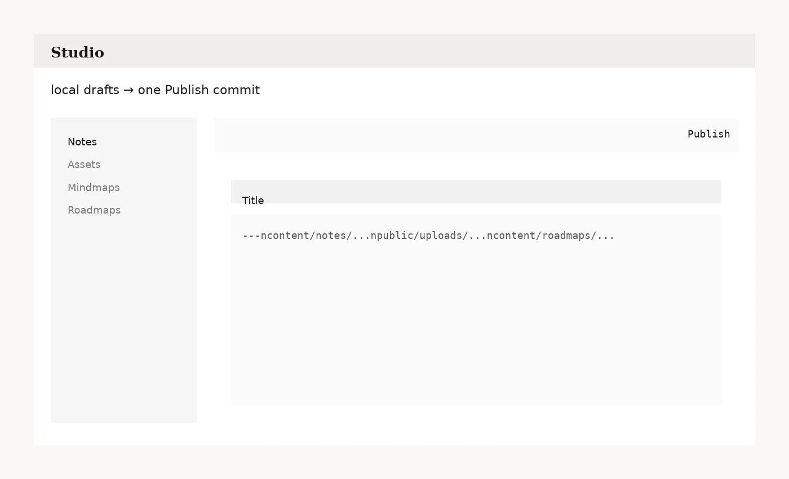

# Studio 使用说明

Studio 是 Hyperblog 的写作台（`/studio/*`）：用 GitHub OAuth 登录，拿到短期 Bearer Token，然后通过 Publisher API 把改动 **commit 到 GitHub main**。公开站点由 GitHub Actions build 后发布到 GitHub Pages。

  

---

## 0) 最重要的规则：不点 Publish，就不会写 GitHub

Studio 故意把“频繁保存”与“发布”拆开：

- **Local draft（本地草稿）**：自动保存到浏览器 `localStorage`，不产生 commit（快、顺手、不会卡）
- **Publish（发布）**：把 *所有本地改动* 合并成 **一次 GitHub commit**（可同时包含 Notes / Assets / Roadmaps / Mindmaps / Config / Deletes）

公开站点默认不展示 `draft: true` 的 Note（但它仍然可以被 commit，用于跨设备同步）。

内容格式规范：[content-formats.md](content-formats.md)

---

## 1) 进入 Studio（本地 / 线上）

- 线上：`https://<user>.github.io/studio/notes`
- 本地：`http://localhost:5173/studio/notes`

首次进入会看到登录按钮：`Login with GitHub`。

### 登录流程（你会看到什么）

1. 点击 `Login with GitHub`
2. 跳转 GitHub 授权
3. 授权完成后回到 `/<site>/auth/callback`
4. Studio 把 token 存到 `sessionStorage`，再跳回你原本的 Studio 页面

常见报错：

- `403 Not allowed`：你的 GitHub 用户名不在 Publisher 的 `ADMIN_GITHUB_LOGINS` 白名单里
- `Session expired`：token 过期/被清理，重新登录即可

---

## 2) 顶部栏：状态条 / Publish / Sync / Logout

### 状态条（Git 风格）

它回答三件事：

- **要发布到哪个仓库/分支？**（`owner/repo · branch`）
- **远端 HEAD 在哪？**（`HEAD abc1234`）
- **本地有多少改动待发布？**（`Drafts / Ops`）

> Drafts 是草稿条目数；Ops 是将写入 GitHub 的操作计数（含 upload/delete）。

### Publish（统一发布按钮）

- **全局语义**：一次 commit 提交 Studio 里所有未发布改动
- commit message 在 `Changes` 页编辑（默认会按改动类型自动生成）

### Sync（强制同步）

- 清空 Studio 的**远端缓存**并从 GitHub 重新拉取（更稳）
- **不会删除本地草稿**（draft 依然在）

### Logout

- 清掉 `sessionStorage` 里的 token

---

## 3) Changes（`/studio/changes`）：像 git diff 一样看清楚“你将提交什么”

Changes 是 Studio 的总控台：

- 汇总所有本地草稿与 staged delete
- 显示 diff（类似 `git diff`）
- 编辑 commit message
- 一键 Publish（全局）

### Diff 模式：Cached vs Remote

- `Cached`：与本地缓存的“上次同步版本”对比（快，适合日常）
- `Remote`：与 GitHub main 的**当前版本**对比（稳，适合冲突时确认覆盖范围）

### 冲突（`HEAD_MOVED` / main advanced）

如果 Publish 失败并提示 `HEAD_MOVED`（`main` 在你发布期间被推进了）：

1. 打开 `Changes`，切到 `Remote` diff
2. 确认覆盖/写入范围
3. 点击 `Retry publish`（会先刷新远端 HEAD，再重试）

---

## 4) Notes（`/studio/notes`）

布局：左侧列表 / 中间正文编辑器 / 右侧 Metadata。

### 新建与打开

- `New`：新建一篇 Note（如果当前有未保存内容会提示）
- 点击左侧条目：打开现有 Note
- 如果本地有同一篇 Note 的草稿，会询问是否恢复

### 编辑模式与快捷键

- `Edit / Split / Preview` 三种视图
- 快捷键：
  - `Ctrl/Cmd+S`：保存本地草稿
  - `Ctrl/Cmd+Enter`：进入发布（触发全局 Publish）

### 上传图片 / PDF（Upload）

- 文件会进入 `Staged uploads`（暂存区），**在你 Publish 时一起 commit**
- 插入规则：
  - 图片：``
  - 其他文件：`[name](/uploads/...)`
- `Cover URL` 可填任意 `/uploads/...` 作为封面（可选）

### Metadata（右侧）

- `Categories`：输入 category id 回车；也可点击 chip 快速勾选（来自 `content/categories.yml`）
- `Tags`：自由输入
- `Roadmap nodes`：把 Note 挂到 roadmap 节点（例如 `ai-infra/otel`）
- `Mindmaps`：引用 mindmap id（前台会作为入口/可选嵌入）
- `Draft`：勾选后前台默认不展示（但仍可 publish 到 GitHub）

### 删除（也走统一 Publish）

- `Stage delete`：只是本地标记“待删除”
- `Publish`：产生一次 commit，把文件移到 `content/.trash/notes/` 并从 `content/notes/` 删除
- `Unstage delete`：撤销待删除标记

---

## 5) Assets（`/studio/assets`）

资产库管理 `public/uploads/*`。

- `Upload`：把文件加入暂存区
- 资产卡片上的 `Trash`：加入 staged delete（不会立刻删除）
- `Publish`：一次提交写入所有 staged uploads/deletes

常用操作：

- `Copy URL`：复制 `/uploads/...`
- `Copy Markdown`：复制 ``

---

## 6) Roadmaps（`/studio/roadmaps`）

Roadmap 是 YAML（`content/roadmaps/<id>.yml`）。

- Preview：
  - Graph 是主视图
  - Outline 可展开/收起
  - `Horizontal/Vertical` 只影响预览（不改文件），用于快速检查布局

删除同样走 staged delete → Publish（会移到 `content/.trash/roadmaps/`）。

---

## 7) Mindmaps（`/studio/mindmaps`）

Mindmap 存储为 ReactFlow JSON（`content/mindmaps/<id>.json`），建议在 Studio 里可视化编辑。

画布操作：

- 双击空白处：新增节点
- 拖拽节点连接点：建立边
- `Backspace/Delete`：删除选中节点/边
- `Fit`：自动缩放到合适视图

删除同样走 staged delete → Publish（会移到 `content/.trash/mindmaps/`）。

---

## 8) Config（`/studio/config`）

Config 页面编辑三份驱动文件：

- Profile：`content/profile.json`
- Categories：`content/categories.yml`
- Projects：`content/projects.json`

要点：

- 结构化编辑 + 原始文本（YAML/JSON）两种视图并存
- 如果你怀疑与 GitHub 不一致，先点 `Sync` 再继续

---

## 9) 本地开发常见误会：我发布了，但 localhost 没变

Studio 写入的是 **GitHub main**。你本机的 `content/*` 不会自动更新。

- 想让 `pnpm dev` 看到刚发布的内容：在仓库目录执行 `git pull`
- 想让 `https://<user>.github.io` 更新：等待 GitHub Actions build 完成即可
